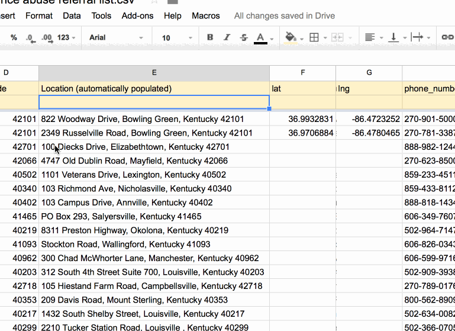

# Get Help Lex  

## I want to help develop Finda

Great! Quick setup:

    npm install
    npm install -g http-server
    npm start

Visit [localhost:8080](http://localhost:8080/) to see the app.

A bit more background:

The project is based on Code for Boston's [finda](https://github.com/codeforboston/finda) project. In Lexington we've customized it for our needs:

 * The facilities [are read](https://github.com/openlexington/gethelplex/blob/gh-pages/src/data/geojson.js#L10) from a Google spreadsheet using the [Tabletop.js](https://github.com/jsoma/tabletop) library. This way our stakeholders have realtime ability to update facilities.
 * We hacked the [facet handling](https://github.com/openlexington/gethelplex/blob/gh-pages/src/ui/facet.js) to guide the user through a 'survey'. It narrows down the facilities based on type of treatment, the insurance they accept, etc.

Let's say you want to new information about facilities like "do they let you smoke." You would want to add a column to the [facilities spreadsheet](https://docs.google.com/spreadsheets/d/1ubx07oylGxk5FDIjMnQo4cMNBd3a8QYiPm27rWuyByI/edit#gid=145432932) called smoking_permited (or similar):

* make a copy of the existing spreadsheet
* copy paste the new spreadsheet's key to the [Tabletop.js init](https://github.com/openlexington/gethelplex/blob/gh-pages/src/data/geojson.js#L12)
* then you'll update [config.json](https://github.com/openlexington/gethelplex/blob/gh-pages/config.json) [todo, flesh this step out more :)]

A lot of Code for Boston's [development documentation](https://github.com/codeforboston/finda/wiki/Developing-Finda) is still relevant. Let us know if you hit any key differences for Lexington and we'll update this readme!

Look in the [waffle board](https://waffle.io/openlexington/finda) for priority issues.

## How to Test

You can run tests once by running: `npm test`

Keep test server running to speed up tests. Start test server:

    npm run test-server

Kick off a test run when the test server is running:

    npm run test-client

## Analytics and feedback

GetHelpLex uses Google Tag Manager to manage Google Analytics as described in the [Unified Analytics repository](https://github.com/laurenancona/unified-analytics).

GetHelpLex posts feedback to a Google Spreadsheet [as described here](https://mashe.hawksey.info/2014/07/google-sheets-as-a-database-insert-with-apps-script-using-postget-methods-with-ajax-example/).
As a backup, feedback is tracked using the [ga-feedback approach](https://github.com/luckyshot/ga-feedback) managed by Google Tag Manager [as described here](http://erikschwartz.net/2016-01-23-google-analytics-events-in-google-tag-manager/).

Feedback is emailed to addresses defined in the script attached to the [feedback spreadsheet](https://docs.google.com/spreadsheets/d/1lP-OsypwXFkH-S3F3Re34fBPSYgpr1ZXY6bRD85w3V8/edit).

To make changes to the script that handles feedback requests:

* edit in the Appscript editor
* `Publish` > `Deploy as webapp` > `Version: new`

## Add map coordinates for new facilities

